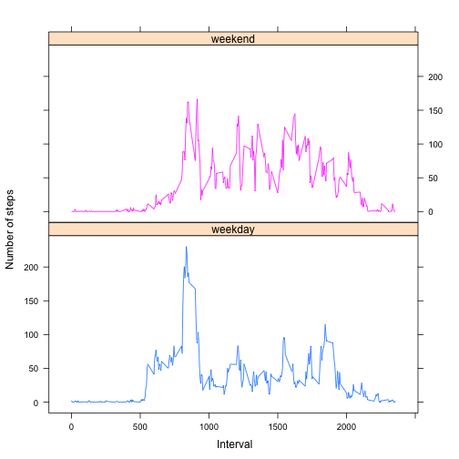

# Reproducible Research: Peer Assessment 1


```r
library(knitr)
opts_chunk$set(echo = TRUE, results = 'hold')
```

## Loading and preprocessing the data

Download the zip file, extract the data `activity.csv`, use `dir()` to check to see if file is in the current working directory and load the data using `read.csv()`. 

```r
fileUrl <- "https://d396qusza40orc.cloudfront.net/repdata%2Fdata%2Factivity.zip"
download.file(fileUrl, destfile = "repdata.zip", method = "curl")
unzip("./repdata.zip")
data <- read.csv('activity.csv')
```

Convert the **date** column to Date class. 

```r
data$date <- as.Date(data$date, format = "%Y-%m-%d")
```


## What is mean total number of steps taken per day?

Make a histogram of the total number of steps taken per day. 

```r
total.steps <- as.numeric(tapply(data$steps, data$date, sum))
hist(total.steps, breaks = 20, xlab = "Total Daily Steps", main = " Total steps taken per day")
```

 

Calculte the **mean** and **median** of total number of steps taken per day.

```r
mean(total.steps, na.rm = TRUE)
median(total.steps, na.rm = TRUE)
```

```
## [1] 10766
```

```
## [1] 10765
```


## What is the average daily activity pattern?

Calculate the average number of steps taken per 5-minute interval and put into a dataframe.  

```r
mean.interval <- tapply(data$steps, data$interval, mean, na.rm = TRUE)
avg.steps <- data.frame(cbind(data$interval, mean.interval))
colnames(avg.steps) <- c("interval", "steps")
```

Make a time series plot of the 5-minute interval (x-axis) and average number of steps taken, averaged across all days (y-axis).

```r
library(ggplot2)
p <- ggplot(avg.steps, aes(interval,steps)) + geom_line()
pp <- p + labs((list(title = "Average daily activity pattern", x = "Interval", y = "Average number of steps")))
print(pp)
```

 

Find the 5-minute interval which contains the maximum number of steps.

```r
max.interval <- avg.steps[which.max(avg.steps$steps), ]
max.interval
```

```
##     interval steps
## 104      835 206.2
```

## Imputing missing values

Calculate the total number of missing values (NA) in the dataset.

```r
miss <- sum(is.na(data$steps)); miss
```

```
## [1] 2304
```

Use the mean for the 5-minute interval to fill in the missing values in dataset. 

```r
newdata <- data
newdata[is.na(newdata[,1]),1] <- avg.steps[is.na(newdata[, 1]), 2]
```

Make a histogram of the total number of steps taken each day with the new dataset. 

```r
hist(tapply(newdata$steps, newdata$date, sum), breaks = 20, xlab = "Total steps", main = " Total steps taken per day")
```

 

Calculate the **mean** and **median** total number of steps taken per day.

```r
mean(tapply(newdata$steps, newdata$date, sum))
median(tapply(newdata$steps, newdata$date, sum))
```

```
## [1] 10766
```

```
## [1] 10766
```

Here we can see by imputing the missing data on the estimates, the mean and median are equivalent. By doing this we can see that the mean and median are very similiar to the estimates taken previously, thus there is no impact. 

## Are there differences in activity patterns between weekdays and weekends?

Create a new factor variable with two levels (i.e. day) to indicate if the day is a   weekend or weekday.

```r
newdata$day <- as.factor(ifelse(weekdays(newdata$date) %in% c("Saturday", "Sunday"), 
                                "weekend", "weekday"))
```

Make a time series plot of the 5-minute interval (x-axis) and the average number of steps taken, averaged across all weekdays or weekend days(y-axis).

```r
library(lattice)
xyplot(steps ~ interval | day, aggregate(steps ~ interval + day, newdata, mean), 
       layout = c(1, 2), type = "l", group = day, xlab = " Interval" , ylab = "Number of steps")
```

 

The graph shows that acitivity on the weekday has a greater peak from average number of steps taken on a given time interval. However, the weekend shows a greater distribution of steps taken over all intervals. This could be a clear indication that more activity is taken place during the weekend. 
